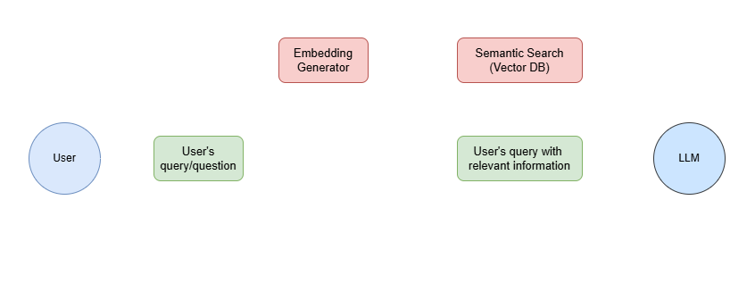

# RAG-LLM-Energy-Expert

This repository contains the development of a RAG application which contains information related to the current energy politics in Mexico, in order to be a referal whenever an energy expert has doubts related to the legal part of the development of any energy project.

*This system will be developed using [Google Cloud](https://cloud.google.com/?hl=en).

## RAG

RAG (Retrieval-Augmented Generation) is an architecture that combines search with AI. It  first finds relevant information from documents, and then uses a language model (such as chat-GPT) to generate a response based on that info. This helps give more accurate and fact-based answers.

This technique is really helpful because:

- Improves accuracy of the LLM answers.
- Reduces hallucinations (generation of false information).
- Allow the LLM to access more contextually, relevant, and up-to-date information.

The main steps of a RAG technique are:

1. ***User Query***: The user asks a question based on a related topic.
2. ***Embedding & Retrieval***: The system turn the query into a vector and rertieves relevant documents from a knowledge base (mainly a vector database) using similarity search
3. ***Context Building***: The retrieved documents are combined with the original query and then, it is passed to the LLM
4. ***Generation***: A language model uses this context to generate an accurate, grounded answer

The first section of the RAG system that was developed and deployed on *CloudRun* was the [Embedding Generator](rag_llm_energy_expert/services/embeddings)

## Embedding Generator

This is a key part of all the RAG technique due to allows to upload documents to a [vector database](https://qdrant.tech/articles/what-is-a-vector-database/), (in this case, I'm using  [Qdrant Vector DB](https://qdrant.tech/documentation/)), which is important because it allows to retrieve the most relevant documents based on a semantic search agains the user's query.

The basic concept of this embedding generator can be found in the notebook [embeddings](notebooks/embeddings.ipynb). 

Currently, an ingestion pipeline is being developed [here](rag_llm_energy_expert/services/ingestion_pipeline), which will take PDF files stored in Google Cloud Storage (GCS), embedded using the deployed Embedding Service, and then uploaded into the Qdrant vector DB.